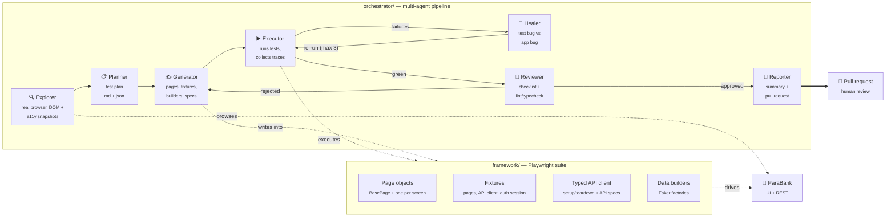

# TestPilot_AI

[](https://github.com/TechZainShahzad/TestPilot_AI/actions/workflows/ci.yml)
[](https://github.com/TechZainShahzad/TestPilot_AI/actions/workflows/nightly.yml)
[](https://TechZainShahzad.github.io/TestPilot_AI/)
[](LICENSE)

**A production-grade Playwright + TypeScript framework for a demo banking
app — and a multi-agent orchestrator that writes it.**

Point the orchestrator at a URL and a feature name. It explores the app in a
real browser, plans positive/negative/boundary cases, writes page objects and
specs that match the existing conventions, runs them, heals its own failures,
reviews the result against a checklist, and opens a pull request.

A human merges. Nothing is ever pushed straight to `main`.

---

## Status

> Built in phases. This section tracks what is actually working, not what is
> planned.

| Phase | Scope                                               | Status  |
| ----- | --------------------------------------------------- | ------- |
| 1     | Repo scaffold, tooling, CI skeleton                 | ✅ Done |
| 2     | Framework core (pages, fixtures, API, data) + smoke | ✅ Done |
| 3     | Full regression coverage + Allure on Pages          | ✅ Done |
| 4     | Orchestrator: provider layer, Explorer, Planner     | ✅ Done |
| 5     | Orchestrator: Generator, Executor, Healer           | ✅ Done |
| 6     | Orchestrator: Reviewer, Reporter, PR creation       | ✅ Done |
| 7     | Documentation polish + committed example run        | 🚧 Next |

---

## Architecture



The two halves are deliberately separable. The framework stands on its own as
a test suite; the orchestrator is a client of it that happens to write code
into it. Neither imports the other.

---

## Quick start

Requires **Node 22+** (`.nvmrc` pins 24) and no account anywhere.

```bash
git clone https://github.com/TechZainShahzad/TestPilot_AI.git
cd TestPilot_AI
npm ci
npm run install:browsers --workspace=framework

# Static checks — format, lint, strict type-check
npm run verify

# Smoke suite against the live demo app
npm run test:smoke
```

No `.env` is needed to run the tests: every setting has a working default.
Copy `.env.example` to `.env` only to change the target URL, run headed, or
use the orchestrator.

### Running the tests

```bash
npm test                  # everything
npm run test:smoke        # @smoke — the CI gate
npm run test:regression   # @regression — the nightly suite
npm run test:ui           # @ui only
npm run test:api          # @api only

npm run report            # open the last Playwright HTML report
npm run allure:serve --workspace=framework   # Allure report, locally
```

Suites are selected by tag via `--grep`, so a test's membership is visible in
its title rather than hidden in config.

### Running the orchestrator

```bash
cp .env.example .env      # then set GEMINI_API_KEY (free — see below)

npm run orchestrate -- --url https://parabank.parasoft.com --feature "Bill Pay"
npm run orchestrate -- --feature "Transfer Funds" --dry-run
```

`--dry-run` plans, generates and runs the tests but never opens a pull
request. It is also forced on automatically when `GITHUB_TOKEN` is absent, so
there is no way to accidentally push from a fresh clone.

Every run writes a fully inspectable folder under
`orchestrator/runs/<timestamp>/` — one typed JSON artifact per agent, plus the
run log and token accounting. A sample is committed under [`examples/`](examples/)
so the output can be read without running anything.

---

## Design decisions

**Why the orchestrator browses the app instead of guessing selectors.**
An LLM asked to write a locator from a feature name invents
`#billpay-submit-btn`. The Explorer agent drives a real browser and reads the
accessibility tree, so the Generator writes locators against elements that
demonstrably exist. This is the single biggest difference between tests that
run and tests that look plausible.

**Why the Healer is allowed to edit tests but not assertions.**
The cheapest way to make a failing test pass is to assert less. A self-healing
loop with no constraint converges on exactly that, and the result is a green
suite that tests nothing. The Healer may fix locators, waits and setup; it is
prompted and reviewed against weakening an assertion, and a failure it cannot
fix that way is reported as a _suspected application bug_ rather than hidden.

**Why a provider abstraction instead of one SDK.**
The agents talk through a narrow interface (`chat`, `tools`, token accounting)
with Gemini and Groq implementations behind it. Both have usable free tiers,
which matters for a project people are meant to clone and actually run.

**Why a fresh customer per run.**
ParaBank is a shared public demo whose data resets on someone else's schedule,
and the balance-consistency specs assert that a UI balance matches an API
balance after a transfer. Against a shared account that assertion is a coin
flip. Each run registers its own Faker-generated customer and reuses the
session via `storageState`, so it logs in once and is immune to other people's
traffic.

**Why `strict` plus six more compiler flags.**
`noUncheckedIndexedAccess` and `exactOptionalPropertyTypes` are what stop a
page object from quietly handing back `any` out of a locator chain.
`no-floating-promises` is an error rather than a warning because a missing
`await` on a Playwright action does not fail — it silently passes.

**Why the API client doesn't correct what it reads.**
`createAccount` reports a new account's balance as `0` — but it actually
debits the funding account exactly $100 and credits it to the new one,
confirmed by reading both accounts' transaction history immediately
afterward. The client returns that stale `0` as-is rather than quietly
fixing it, because the whole point of a typed client here is to reflect what
the real API does, quirks included; the test-data helpers that need the true
balance account for it explicitly instead. See "Known application
limitations" in [`docs/architecture.md`](docs/architecture.md) — found by
writing real regression tests against the live app, not by reading docs that
don't exist for this API.

Fuller reasoning lives in [`docs/architecture.md`](docs/architecture.md); each
agent's prompts, I/O contract and guardrails are in
[`docs/agents.md`](docs/agents.md).

---

## Repository layout

```
framework/              Playwright suite — stands alone
  src/pages/            BasePage + one page object per screen
  src/api/              Typed ParaBank REST client
  src/fixtures/         Custom fixtures: page objects, API client, auth
  src/data/             Faker-backed builders and factories
  src/utils/            Config, logging, shared helpers
  tests/ui/             Browser specs
  tests/api/            Pure REST specs
  playwright.config.ts

orchestrator/           Multi-agent pipeline — a client of the framework
  src/agents/           Explorer, Planner, Generator, Executor, Healer, …
  src/providers/        Gemini + Groq behind one interface
  src/core/             State machine, run artifacts, config, guardrails
  src/tools/            Capabilities exposed to the agents
  runs/                 Per-run artifacts (git-ignored)

docs/                   Architecture and agent documentation
examples/               A committed sample run
.github/workflows/      CI, nightly sharded regression, Pages publishing
```

---

## Getting a free API key

**Gemini** (default) — [aistudio.google.com/apikey](https://aistudio.google.com/apikey).
Sign in with Google, _Create API key_, paste into `GEMINI_API_KEY`.

**Groq** (alternate) — [console.groq.com/keys](https://console.groq.com/keys).
Sign up, _Create API Key_, paste into `GROQ_API_KEY`, and set
`LLM_PROVIDER=groq`.

For pull-request creation, add a fine-grained
[personal access token](https://github.com/settings/personal-access-tokens)
scoped to this repository with **Contents: write** and **Pull requests: write**
as `GITHUB_TOKEN`. Without it the orchestrator runs in dry-run mode.

---

## Target application

[ParaBank](https://parabank.parasoft.com) by Parasoft — a public demo banking
app with both a UI and a REST API. It is used purely as a realistic
fintech-shaped target. No real company code, credentials or data appear
anywhere in this repository.

---

## License

[MIT](LICENSE)
