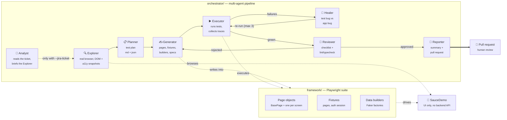

# TestPilot_AI

[](https://github.com/TechZainShahzad/TestPilot_AI/actions/workflows/ci.yml)
[](https://github.com/TechZainShahzad/TestPilot_AI/actions/workflows/nightly.yml)
[](https://TechZainShahzad.github.io/TestPilot_AI/)
[](LICENSE)

**A production-grade Playwright + TypeScript framework for a demo
e-commerce app — and a multi-agent orchestrator that writes it.**

Point the orchestrator at a URL and a feature name. It explores the app in a
real browser, plans positive/negative/boundary cases, writes page objects and
specs that match the existing conventions, runs them, heals its own failures,
reviews the result against a checklist, and opens a pull request.

A human merges. Nothing is ever pushed straight to `main`.

---

## Status

> Built in phases. This section tracks what is actually working, not what is
> planned.

| Phase | Scope                                           | Status  |
| ----- | ----------------------------------------------- | ------- |
| 1     | Repo scaffold, tooling, CI skeleton             | ✅ Done |
| 2     | Framework core (pages, fixtures, data) + smoke  | ✅ Done |
| 3     | Full regression coverage + Allure on Pages      | ✅ Done |
| 4     | Orchestrator: provider layer, Explorer, Planner | ✅ Done |
| 5     | Orchestrator: Generator, Executor, Healer       | ✅ Done |
| 6     | Orchestrator: Reviewer, Reporter, PR creation   | ✅ Done |
| 7     | Documentation polish + committed example run    | ✅ Done |

---

## Architecture



The two halves are deliberately separable. The framework stands on its own as
a test suite; the orchestrator is a client of it that happens to write code
into it. Neither imports the other.

For the full pipeline as one diagram — every branch, every file each stage
writes — see [`docs/workflow.md`](docs/workflow.md). For a dedicated page per
agent, see [`docs/agents/`](docs/agents/).

---

## Quick start

Requires **Node 22+** (`.nvmrc` pins 24) and no account anywhere.

```bash
git clone https://github.com/TechZainShahzad/TestPilot_AI.git
cd TestPilot_AI
npm ci
npm run install:browsers --workspace=framework

# Static checks — format, lint, strict type-check
npm run verify

# Smoke suite against the live demo app
npm run test:smoke
```

No `.env` is needed to run the tests: every setting has a working default.
Copy `.env.example` to `.env` only to change the target URL, run headed, or
use the orchestrator.

### Running the tests

```bash
npm test                  # everything
npm run test:smoke        # @smoke — the CI gate
npm run test:regression   # @regression — the nightly suite
npm run test:guest        # the unauthenticated slice only

npm run report            # open the last Playwright HTML report
npm run allure:serve --workspace=framework   # Allure report, locally
```

Suites are selected by tag via `--grep`, so a test's membership is visible in
its title rather than hidden in config.

### Running the orchestrator

```bash
cp .env.example .env      # then set GEMINI_API_KEY (free — see below)

npm run orchestrate -- --url https://www.saucedemo.com --feature "Checkout Flow"
npm run orchestrate -- --feature "Product Sorting" --dry-run

# Or pull the feature straight from a Jira ticket instead of typing it —
# requires JIRA_BASE_URL/JIRA_EMAIL/JIRA_API_TOKEN in .env
npm run orchestrate -- --jira-ticket PROJ-123 --dry-run

# Or run on Claude Code CLI instead of a free-tier API — local only,
# needs an authenticated `claude` session, not a key
npm run orchestrate -- --feature "Checkout Flow" --provider claude-code --dry-run
```

`--dry-run` plans, generates and runs the tests but never opens a pull
request. It is also forced on automatically when `GITHUB_TOKEN` is absent, so
there is no way to accidentally push from a fresh clone.

`--feature` and `--jira-ticket` are two input sources for the same
pipeline, not two different modes — see "Where the feature description
comes from" in [`docs/agents.md`](docs/agents.md) for how a Jira ticket's
description flows into the same Explorer/Planner prompts a typed feature
name would.

Every run writes a fully inspectable folder under
`orchestrator/runs/<timestamp>/` — one typed JSON artifact per agent, plus the
run log and token accounting. A sample is committed under [`examples/`](examples/)
so the output can be read without running anything.

---

## Design decisions

**Why the orchestrator browses the app instead of guessing selectors.**
An LLM asked to write a locator from a feature name invents
`#billpay-submit-btn`. The Explorer agent drives a real browser and reads the
accessibility tree, so the Generator writes locators against elements that
demonstrably exist. This is the single biggest difference between tests that
run and tests that look plausible.

**Why the Healer is allowed to edit tests but not assertions.**
The cheapest way to make a failing test pass is to assert less. A self-healing
loop with no constraint converges on exactly that, and the result is a green
suite that tests nothing. The Healer may fix locators, waits and setup; it is
prompted and reviewed against weakening an assertion, and a failure it cannot
fix that way is reported as a _suspected application bug_ rather than hidden.

**Why a provider abstraction instead of one SDK.**
The agents talk through a narrow interface (`chat`, `tools`, token accounting)
with Gemini, Groq, and Claude Code CLI implementations behind it. The first
two have usable free tiers, which matters for a project people are meant to
clone and actually run; the third has no HTTP API at all — it shells out to
a local CLI — and slotting it in as "just another implementation" rather
than a special case is the real test of whether the abstraction was honest
in the first place.

**Why fixed demo accounts instead of generated ones.**
SauceDemo has no registration flow at all — every identity is one of its
fixed accounts (`standard_user`, plus deliberately-broken variants like
`locked_out_user` and `problem_user`), all sharing the password
`secret_sauce`. The `setup` project logs in once as the account configured
in `.env` and reuses that session via `storageState`, the same mechanic the
original ParaBank build used for a per-run registered customer — just with
nothing left to generate.

**Why `strict` plus six more compiler flags.**
`noUncheckedIndexedAccess` and `exactOptionalPropertyTypes` are what stop a
page object from quietly handing back `any` out of a locator chain.
`no-floating-promises` is an error rather than a warning because a missing
`await` on a Playwright action does not fail — it silently passes.

**Why there's no API layer.**
SauceDemo has no backend REST API — confirmed live, zero XHR/fetch calls
across a full login → checkout flow. The original ParaBank build had a
typed API client and a parallel `api` test project; neither carries over to
this target, and that's stated here explicitly rather than left for a reader
to notice from the repository layout. See "Why there's no API layer" in
[`docs/architecture.md`](docs/architecture.md).

Fuller reasoning lives in [`docs/architecture.md`](docs/architecture.md); each
agent's prompts, I/O contract and guardrails are in
[`docs/agents.md`](docs/agents.md).

---

## Repository layout

```
framework/              Playwright suite — stands alone
  src/pages/            BasePage + one page object per screen
  src/fixtures/         Custom fixtures: page objects, auth session
  src/data/             Faker-backed builders and factories
  src/utils/            Config, logging, shared helpers
  tests/ui/             Browser specs (no tests/api/ — see "Target application" below)
  playwright.config.ts

orchestrator/           Multi-agent pipeline — a client of the framework
  src/agents/           Explorer, Planner, Generator, Executor, Healer, …
  src/providers/        Gemini + Groq + Claude Code CLI behind one interface
  src/core/             State machine, run artifacts, config, guardrails
  src/tools/            Capabilities exposed to the agents
  runs/                 Per-run artifacts (git-ignored)

docs/                   Architecture and agent documentation
examples/               A committed sample run
.github/workflows/      CI, nightly sharded regression, Pages publishing,
                        manually-triggered orchestration from a Jira ticket
```

---

## Getting a free API key

**Gemini** (default) — [aistudio.google.com/apikey](https://aistudio.google.com/apikey).
Sign in with Google, _Create API key_, paste into `GEMINI_API_KEY`.

**Groq** (alternate) — [console.groq.com/keys](https://console.groq.com/keys).
Sign up, _Create API Key_, paste into `GROQ_API_KEY`, and set
`LLM_PROVIDER=groq`.

**Claude Code CLI** (alternate, **local only** — not usable in CI) — no key
at all. If you already have [Claude Code](https://claude.com/claude-code)
installed and authenticated (a Claude subscription), set
`LLM_PROVIDER=claude-code`. This is the one provider without Groq/Gemini's
free-tier token ceilings — see "Claude Code CLI, confirmed live" in
[`docs/agents.md`](docs/agents.md) for what that trades off and what was
verified live before relying on it.

For pull-request creation, add a fine-grained
[personal access token](https://github.com/settings/personal-access-tokens)
scoped to this repository with **Contents: write** and **Pull requests: write**
as `GITHUB_TOKEN`. Without it the orchestrator runs in dry-run mode.

---

## Target application

[SauceDemo](https://www.saucedemo.com) by Sauce Labs — a public demo
e-commerce app (login → product catalog → cart → checkout) built as a QA
training target, with no backend REST API. It ships several deliberately
broken demo accounts (`problem_user`, `locked_out_user`, and others) as a
testing exercise; the ones this suite found to have reproducible,
distinguishing behavior are documented and covered under "Known application
limitations" in [`docs/architecture.md`](docs/architecture.md). No real
company code, credentials or data appear anywhere in this repository.

This project originally targeted [ParaBank](https://parabank.parasoft.com),
a demo banking app with a REST API. It moved to SauceDemo after ParaBank's
shared Cloudflare-fronted demo temporarily rate-limited a developer's own
browser — automated testing itself was unaffected throughout. The API-layer
coverage ParaBank made possible does not carry over to this target; see
"Why there's no API layer" above.

---

## License

[MIT](LICENSE)
