# End-to-end workflow

One diagram, the exact path a single `npm run orchestrate` invocation takes
from the command line to a pull request, including every file it writes
along the way. For the prose version of "what each agent does and why,"
see [`agents/`](agents/) — this document is the map; `agents/` is the
terrain.

## The full pipeline

```mermaid
flowchart TD
    START(["npm run orchestrate"]) --> ARGS{"--feature name\nor\n--jira-ticket KEY?"}

    ARGS -- "--jira-ticket KEY" --> JIRA["🎫 Step 1 · Jira\nfetch issue, REST API v3"]
    ARGS -- "--feature name" --> NOJIRA["feature = the typed name\nno requirements text"]

    JIRA --> PRCHECK{"GitHub already has a PR\nreferencing this ticket?"}
    PRCHECK -- yes --> PRWARN["⚠️ warn, continue anyway\n(ticket may need more coverage)"]
    PRCHECK -- no --> ANALYST
    PRWARN --> ANALYST

    ANALYST["🧠 Step 2 · Analyst\nunderstands the ticket\nbefore anything explores"]
    ANALYST -- writes --> BRIEF[("brief.json\nbrief.md")]
    BRIEF --> EXPLORER
    NOJIRA --> EXPLORER

    EXPLORER["🔍 Step 3 · Explorer\nreal browser, a11y snapshots\nnavigate / click / fill / snapshot"]
    EXPLORER -- writes --> EXPJSON[("exploration.json")]
    EXPJSON --> PLANNER

    PLANNER["📋 Step 4 · Planner\npositive + negative + boundary cases\nevery acceptance criterion → a case"]
    PLANNER -- writes --> PLANJSON[("plan.json\nplan.md")]
    PLANJSON --> GENERATOR

    subgraph BUILD["Build loop — bounded by MAX_HEAL_ATTEMPTS and MAX_REVIEW_ROUNDS"]
        direction TB
        GENERATOR["✍️ Step 5 · Generator\nwrites page objects, fixtures, specs\nreuses existing code, never duplicates"]
        GENERATOR -- writes --> GENJSON[("generation.json\n+ real files under framework/")]

        GENJSON --> EXECUTOR["▶️ Step 6 · Executor\nreal Playwright run, no model involved"]
        EXECUTOR -- writes --> EXECJSON[("execution-N.json")]

        EXECJSON --> FAILCHECK{"any test failed,\nand heal attempts left?"}
        FAILCHECK -- yes --> HEALER["🔧 Step 7 · Healer\ntest bug → fix it\napp bug → report it, never hide it"]
        HEALER -- writes --> HEALJSON[("healing-N.json\n+ patched files, if fixed")]
        HEALJSON --> EXECUTOR

        FAILCHECK -- "no, or attempts exhausted" --> STATIC["lint + tsc --build\ndeterministic, zero LLM calls"]
        STATIC -- writes --> SCJSON[("static-check-N.json")]

        SCJSON --> SCPASS{"lint AND\ntype-check pass?"}
        SCPASS -- no --> AUTOREJECT["auto-rejected\n(Reviewer agent never runs)"]
        SCPASS -- yes --> REVIEWER["🔬 Step 8 · Reviewer\nPOM, no hard waits, no hard-coded\ndata, real assertions — read-only"]
        REVIEWER -- writes --> REVJSON[("review-N.json")]

        AUTOREJECT -. "rounds left" .-> GENERATOR
        REVJSON --> VERDICT{"approved,\nor rounds exhausted?"}
        VERDICT -- "rejected, rounds left" --> GENERATOR
    end

    VERDICT -- "approved" --> REPORTER
    VERDICT -- "rounds exhausted" --> REPORTER

    REPORTER["📣 Step 9 · Reporter\ndeterministic — templates the summary,\nthen talks to git/GitHub"]
    REPORTER -- writes --> SUMMARY[("summary.md")]

    SUMMARY --> DRYCHECK{"--dry-run,\nor no GITHUB_TOKEN?"}
    DRYCHECK -- yes --> STOP(["Stop. No branch, no PR."])
    DRYCHECK -- no --> GITFLOW["new branch → commit → push"]
    GITFLOW --> PRJSON[("pull-request.json")]
    PRJSON --> DONE(["Pull request open — human review starts here"])

    classDef artifact fill:#1e3a5f,stroke:#7bb0e8,color:#fff;
    classDef decision fill:#3a2e1e,stroke:#e8b07b,color:#fff;
    classDef terminal fill:#2e3a1e,stroke:#b0e87b,color:#fff;
    class BRIEF,EXPJSON,PLANJSON,GENJSON,EXECJSON,HEALJSON,SCJSON,REVJSON,SUMMARY,PRJSON artifact;
    class ARGS,PRCHECK,FAILCHECK,SCPASS,VERDICT,DRYCHECK decision;
    class START,STOP,DONE terminal;
```

Blue boxes are files actually written to `orchestrator/runs/<timestamp>/`.
Everything inside the **Build loop** subgraph can run more than once in a
single invocation — that loop is the only part of the pipeline that isn't
strictly linear.

## Two cross-cutting files, not shown above

Two files are written continuously by _every_ LLM-calling stage (Analyst,
Explorer, Planner, Generator, Healer, Reviewer), not at one point in the
diagram:

| File              | Written by                                           | Contains                                                                                                                                                                                                  |
| ----------------- | ---------------------------------------------------- | --------------------------------------------------------------------------------------------------------------------------------------------------------------------------------------------------------- |
| `run.log`         | `run.appendStep()`, called from `core/agent-loop.ts` | One JSONL line per tool call, tool result, assistant text, or error — the per-action trail.                                                                                                               |
| `llm-calls.jsonl` | `run.recordLlmCall()`, same call site                | One JSONL line per LLM turn — the exact system prompt / user message (or tool results) sent, paired with the exact text and tool calls returned. `--verbose-llm` also previews this live in the terminal. |

Plus `run.json`, written once at the very start (feature, target URL,
provider, start time) — the only artifact that exists before Jira/Analyst
even runs.

## Why it branches the way it does

- **Jira is optional, Analyst follows it.** `--feature "name"` and
  `--jira-ticket KEY` are mutually exclusive (`parseArgs` rejects both or
  neither). Only a ticket has acceptance criteria worth brainstorming
  about first, so Analyst — and the step-2 slot it occupies — is skipped
  entirely on a plain `--feature` run; numbering still reserves step 2 for
  it, the same convention the Jira step itself already uses when skipped.
- **The PR-exists check warns, never blocks.** A ticket might legitimately
  need a second pass (more coverage, a previous run's PR got closed
  without merging) — `findExistingPullRequest` queries GitHub's own search
  API live, rather than keeping a local registry that could drift out of
  sync with reality.
- **The build loop has two independent ceilings.** `Execute ⇄ Heal` is
  bounded by `MAX_HEAL_ATTEMPTS`; `Review → Generate` by
  `MAX_REVIEW_ROUNDS`. An agent that writes code, runs it, reads the
  failure, and tries again is unbounded by construction — both ceilings
  are `.env` configuration, not constants, for exactly that reason.
- **A lint/type-check failure never reaches the Reviewer model.**
  `core/static-check.ts` runs the framework's real ESLint and `tsc
--build` before the Reviewer agent is even started. Either failing is
  an automatic rejection with the real tool output attached as findings —
  there is no verdict for a model to rationalise past, because for a
  purely mechanical failure, no model is consulted at all.
- **The Reporter is the only stage that can touch git, and never touches
  `main`.** It always creates a new `testpilot/<slug>-<timestamp>` branch
  first — there is no code path that commits to the branch the pipeline
  was started on. `--dry-run`, a missing `GITHUB_TOKEN`, or nothing
  actually written all stop it at `summary.md`, before any git command
  runs.

## Reading a run after the fact

Every stage's inputs and outputs are typed, Zod-validated JSON — a run
folder is a complete, inspectable record of one pipeline execution, not
just a log of what happened. See [Run artifacts](agents.md#run-artifacts)
for the full file listing, or [`examples/`](../examples/) for one
committed end to end.
